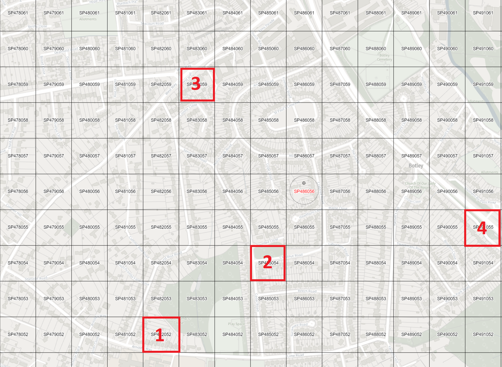

The areas where the noise recording has been taken have been determined by using the grid method. The following grid method applied map is taken from the website <https://britishnationalgrid.uk> where the method is applied to the entire UK map. The map of the region can be accessed [here](https://britishnationalgrid.uk/#SP485055).

Since there is no industrial area in the selected region, the primary noise source will be limited to traffic and residents' noise.

The reason for choosing Botley in this study is that there are settlement areas on the side of the West Way (3) road, where urban traffic flows, and the A34 (4) main road, the inter-city road. In addition, there is a residential area on the interior side where less noise is expected (2) due to no bus route or public building. Finally, the residential area (1), close to the primary school and on the bus route, is one of the areas chosen to compare noise with other areas.

```{r pressure, echo=FALSE, out.width="80%"}

```
