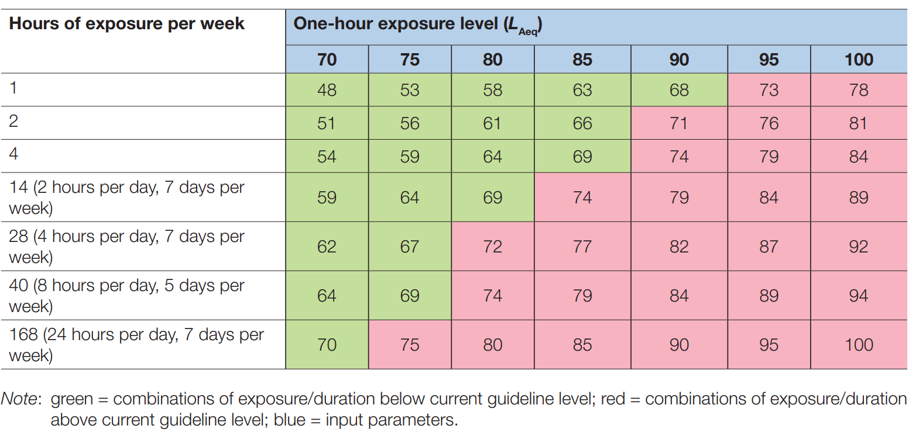

### What is Noise Pollution?

Noise pollution is the increase in natural ambient noise levels caused by sound-generating human activities, which can have negative effects on humans and animals. This type of sound is frequently referred to as anthropogenic noise. Some of these sounds, such as music and sirens, are intentional and desired. The majority of anthropogenic noise, however, is an undesirable by-product, such as traffic or generator noise, as well as the impulsive sounds of explosives [@slabbekoorn2019noise]. As a result, all these sounds and more are components of disturbing noise pollution.

### How does noise adversely affect health?

A relatively recent study [@EuropeanCommission2015] reviewed several articles on the effects of noise on health and determined that stress and sleep disturbance caused by environmental noise contribute to cardiovascular disease and that night-time noise has a more major effect on cardiovascular health than daytime noise. Night-time noise exposure is particularly problematic because it disrupts sleep. The daytime noise exposure of the United Kingdom population affects blood heart disease, pressure, dementia, and stroke, at the cost of £1.34 billion to society. Also, long-term exposure to aircraft noise at night can disrupt sleep, damage blood vessels, and cause cardiovascular disease. In addition, the study revealed that children become hyperactive, inattentive, and emotionally disturbed, particularly when exposed to higher levels of night-time noise.

### When is noise dangerous?

According to the report of the WHO [@WHO2015], short-term exposure to high noise does not have an adverse effect on health, but the effects of exposure to high noise for certain time intervals on average can show themselves over time. These average values can be seen in the table below [@WHO2015].

```{r pressure, echo=FALSE, out.width="90%"}

```

### References
